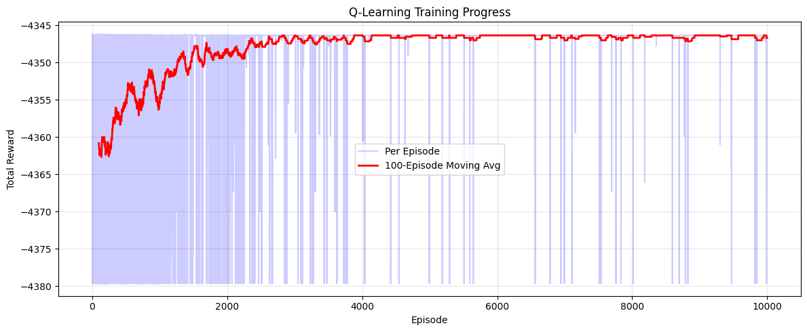
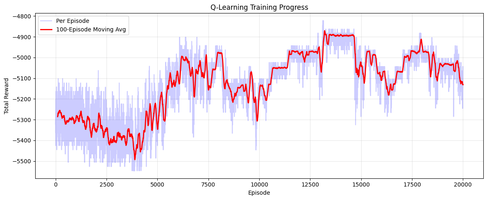

# F1 Pit Stop Strategy Optimization Using Q-Learning Algorithm (Reinforcement Learning)

A reinforcement learning approach to optimizing Formula 1 pit stop strategy using Q-Learning with action masking, trained against real race data from the 2023 Italian Grand Prix (Monza).

## Overview

This project uses **Q-Learning** to train an agent that decides the optimal lap to pit and which tire compound to switch to during a simulated F1 race. The agent races against a **Rival Bot** with a fixed strategy and must beat its total race time while respecting F1's two-compound rule.

### Phase 1: Data & Simulation Setup

Race data is loaded from the **2023 Italian Grand Prix (Monza)** using [FastF1](https://github.com/theOehrly/Fast-F1). Key extracted parameters:

- **Base Lap Time:** ~86.5s
- **Estimated Pit Loss:** ~20.3s (median pit lap time − median race pace)

A tire degradation model simulates realistic performance drop-off:

| Compound | Deg Rate   | Cliff Starts | Extra Deg After Cliff |
|----------|------------|--------------|----------------------|
| Soft     | 0.05 s/lap | Lap 16       | +0.40 s/lap          |
| Medium   | 0.03 s/lap | Lap 26       | +0.20 s/lap          |
| Hard     | 0.015 s/lap | —           | None                 |

### Phase 2: Set up Environment

The race is modeled as a **Gymnasium environment** (`F1PitStopEnv`) with:
- **State Space:** `[Lap, Tire Age, Compound, Gap to Rival]` — all normalized to `[0, 1]`
- **Action Space:** `Discrete(4)` — Stay Out, Pit Soft, Pit Medium, Pit Hard
- **Reward:** `-(lap time in seconds)` per step, with `+100` for winning and `-100` for losing at race end

### Phase 3: Q-Learning Agent with Action Masking

The agent uses **tabular Q-Learning** with a critical design choice: **action masking** instead of penalty-based reward shaping.

**Action masking rules:**
- Cannot pit before Lap 10
- Cannot pit more than once (1-stop strategy enforced)
- Cannot pit for the same compound already equipped
- Must use at least 2 different compounds (F1 regulation)

### Phase 4: Rival Bot

A `RivalBot` runs a fixed **Medium → Hard** strategy, pitting on Lap 22. The agent starts on **Softs** and must find the optimal pit window.

## Key Results

### Win Rate vs. Rival Base Lap Time

| Rival Base Pace | Agent Win Rate | Agent Strategy | Time Advantage |
| **89.0s**       | **100%**     | Soft → Hard, Pit Lap 11 | +126.1s |
| **87.0s**       | **100%**     | Soft → Hard, Pit Lap 11 | +24.1s  |
| **86.5s**       | **0%**       | Soft → Hard, Pit Lap 11 | −1.1s   |

The agent consistently discovers the **Soft → Hard** strategy with a pit stop around **Lap 11**, which is mathematically optimal given the degradation model. It wins convincingly against slower rivals but cannot overcome a rival with identical base pace due to the rival's superior Medium compound choice for the first stint.

### Training Convergence

Training with action masking converges cleanly within ~2,000 episodes, compared to the unstable, non-converging behavior seen in earlier penalty-based approaches.

**Final training run (with action masking):**

The reward curve plateaus at approximately **-4,346**, corresponding to the agent's optimal total race time of **~4,446s** minus the +100 win bonus.

**Earlier failed runs (without action masking):**

These earlier runs show the hallmarks of reward-shaping failure: oscillating rewards, periodic collapses, and inability to converge on a stable policy. The agent would exploit penalty loopholes (e.g., pitting every 5 laps on fresh Softs, or deliberately getting disqualified).

## Discussion: Limitations of This Approach

### Why Q-Learning may not be optimal Here

1. **Deterministic environment.** The race simulation has no randomness, tire degradation, lap times, and rival behavior are fully predictable. 

2. **Reward shaping is fragile.** Early attempts used penalties (-500, -1000, -1500, -5000) to discourage bad behavior (pitting too early, using only one compound, excessive pit stops). The agent consistently found loopholes:
   - **Penalty too small?** Agent accepts the penalty because the time savings outweigh it.
   - **Penalty too large?** Agent avoids the action entirely and never explores near-optimal alternatives.

3. **Action masking was the real fix.** The breakthrough came from *preventing* illegal actions rather than *penalizing* them.

### What Would Work Better

- **Dynamic Programming** — Since the model is fully known and deterministic, DP would find the global optimum instantly.

### Takeaway

Q-Learning with action masking works for this problem, but it required significant iteration to arrive at a correct formulation. The exercise demonstrates both the power and the fragility of reward shaping in reinforcement learning and why constraining the action space is often more effective than crafting complex penalty functions.

## Tech Stack

- **Python 3.11**
- **FastF1** — F1 telemetry and race data
- **Gymnasium** — RL environment framework
- **NumPy** — Q-table and numerical operations
- **Pandas** — Data manipulation
- **Matplotlib** — Training curve visualization

## License

This project is for educational and personal use.
